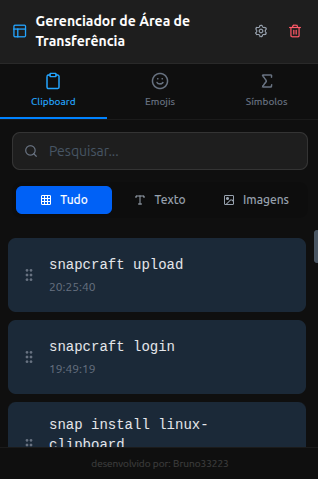
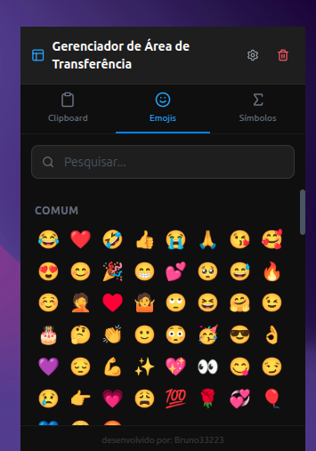
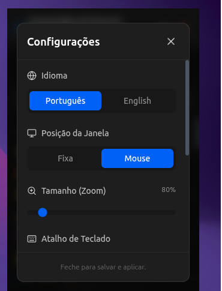

# Linux-Clipboard Manager

A modern and efficient clipboard manager for Linux (compatible with Linux Mint and other distributions), built with **Tauri v2**, **Rust**, **React**, **TypeScript**, and **Vite**. Inspired by Windows Clipboard History (`Win+V`).



## 📸 Screenshots

<p float="left">
  
  
</p>

## 🚀 Features

- **Complete History**: Stores text and images copied to the clipboard.
- **Modern Interface**: "Card" style layout with support for **Light** and **Dark** themes.
- **Rich Content**:
  - **Emoji Picker**: Browse, search, and paste emojis. Includes a **Recent** section for your most used emojis.
  - **Symbols**: Quick access to math, currency, arrows, and other symbols.
- **Internationalization 🌍**: Available in **English** and **Portuguese (Brazil)**.
- **Powerful Organization**:
  - **Categories**: Filter by "All", "Text", "Images", "Emojis", or "Symbols".
  - **Search**: Quickly find what you copied.
  - **Drag & Drop**: Reorder your items by dragging and dropping.
  - **Pin Items**: Keep important items pinned to the top.
- **Customization**:
  - **Zoom** adjustment for the interface.
  - Window positioning (follow the cursor).
- **System Integration**:
  - **Ultra Lightweight**: Built with Rust/Tauri for minimal resource usage.
  - Runs in the background (System Tray).
  - Single instance behavior (toggles window visibility when opened again).

## 🛠️ Technologies

- [Tauri v2](https://tauri.app/) (Rust Backend)
- [React](https://react.dev/)
- [Vite](https://vitejs.dev/)
- [TailwindCSS](https://tailwindcss.com/)
- [dnd-kit](https://dndkit.com/) (Drag and Drop)

## 📦 How to Use

### Prerequisites

Ensure you have the following installed:
- [Node.js](https://nodejs.org/) (v20+)
- [Rust](https://www.rust-lang.org/tools/install) (latest stable)
- System dependencies (libwebkit2gtk-4.0-dev, etc. - see Tauri docs)

### Installation (Snap Store)

The easiest way to install is via the Snap Store:

```bash
sudo snap install linux-clipboard
```

### Installation (Pre-built)

Download the latest version from the **Releases** page:
- **AppImage**: Portable, works on most distros.
- **Deb**: Proper installation for Debian/Ubuntu/Mint.
- **Snap**: Available via Release artifacts.

### Running from Source

1. Clone the repository:
   ```bash
   git clone https://github.com/bruno33223/Linux-ClipBoard.git
   cd Linux-ClipBoard
   ```

2. Install dependencies:
   ```bash
   npm install
   ```

3. Start Development Mode:
   ```bash
   npm run input-dev
   # OR
   npm run tauri dev
   ```

### Build (Production)

To create the executable or package for distribution:

```bash
# Builds .deb and .AppImage
npm run tauri build
```

The artifacts will be in `src-tauri/target/release/bundle/`.

#### Generating Snap Packages
Due to permission requirements, generating `.snap` packages locally can be difficult. We recommend using **GitHub Actions**:
1. Push your code to GitHub.
2. Go to the **Actions** tab.
3. Run the **Build Snap Package** workflow.
4. Download the artifact from the workflow summary.

## ⌨️ Setting up Global Shortcut (Linux)

To open the manager with a keyboard shortcut (like `Super+V`), configure a native shortcut in your desktop environment (Cinnamon, GNOME, KDE, etc.):

1. Go to **System Settings** > **Keyboard** > **Shortcuts**.
2. Add a **Custom Shortcut**.
3. **Command**:
   - If installed via AppImage: `/path/to/Linux-Clipboard.AppImage`
   - If installed via Deb: `/usr/bin/linux-clipboard`
4. Define the desired shortcut key (e.g., `Super+V`).

*Note: The application checks for existing instances. If already running, checking the shortcut simply brings the existing window to the cursor ("Toggle" behavior).*

## 📝 License

This project is under the MIT license.
